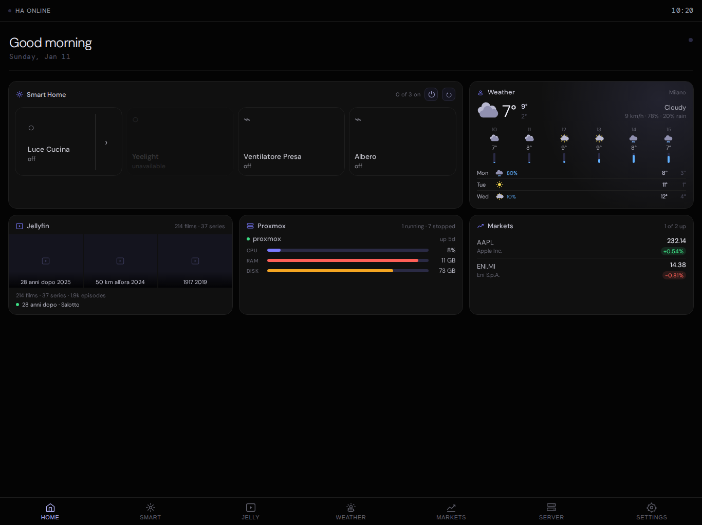
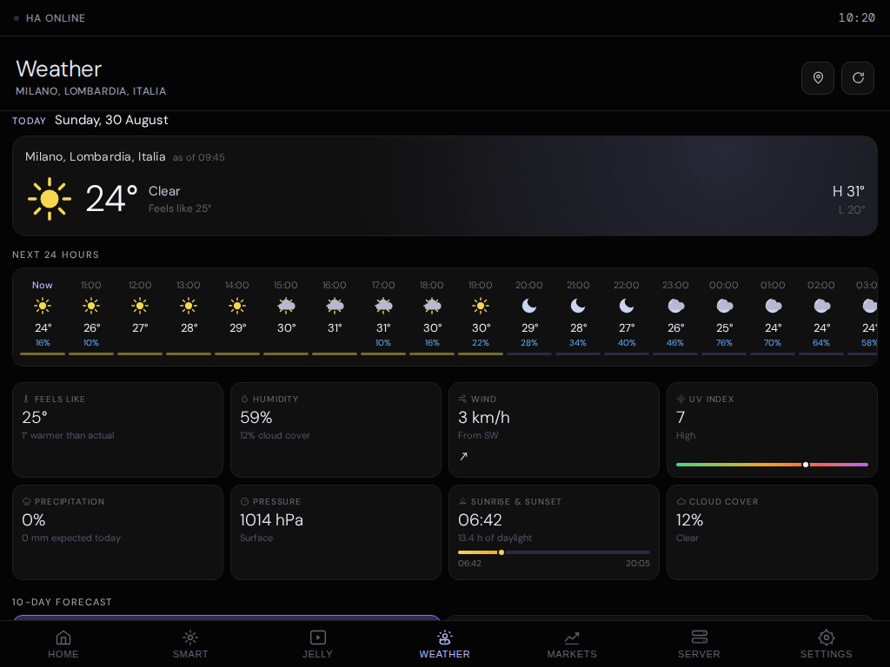
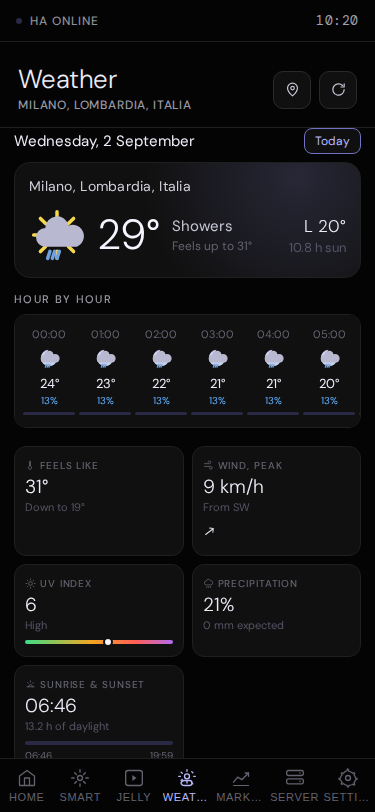
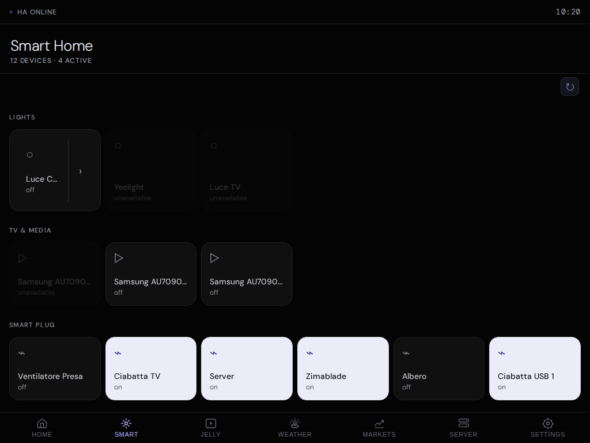
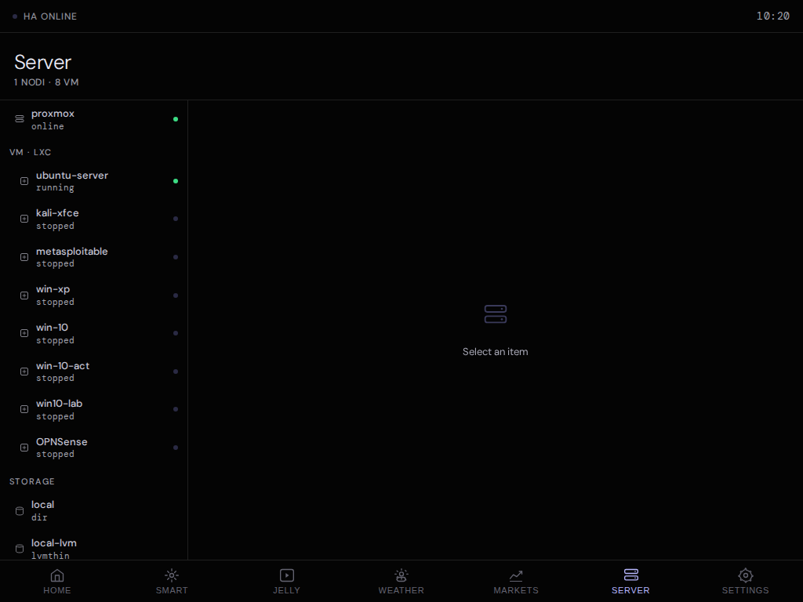
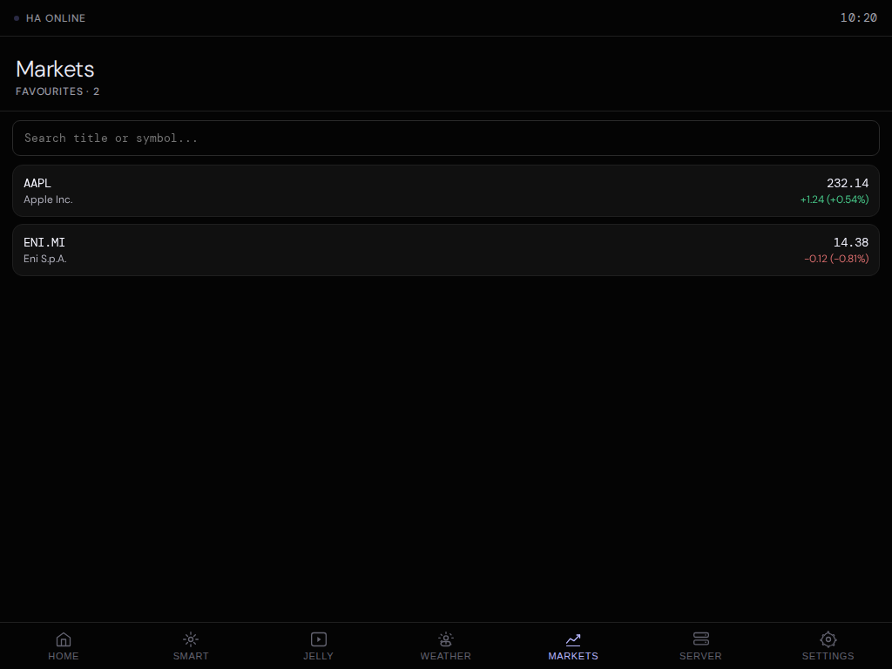
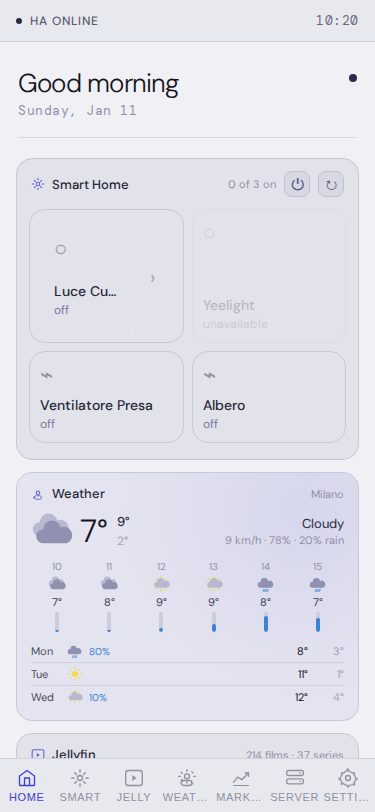
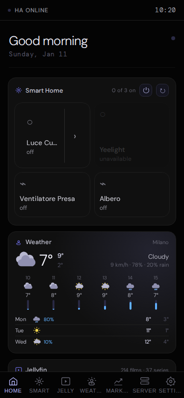
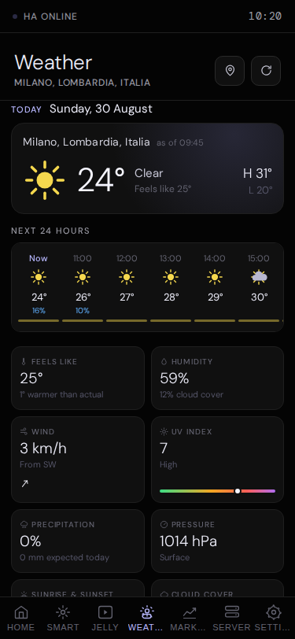

# gres

**A lightweight control pane for your home lab.** One page that puts your
smart home, media server, virtual machines, weather and markets side by
side — built to sit on a wall-mounted tablet and just stay on.



gres is a small Node/Express app with a hand-written frontend: no build
step, no framework, no database. It holds your integration credentials
server-side and proxies to them, so the browser never sees a token.

| Integration | What you get |
|---|---|
| **Home Assistant** | Lights, switches, media players, climate and covers — toggle from the dashboard, dim and recolour lights from a detail sheet |
| **Jellyfin** | Library counts, recently added artwork, and what is streaming right now |
| **Proxmox VE** | Per-node CPU / memory / storage, running and stopped guests, VM start/stop, live graphs and a noVNC console link |
| **Open-Meteo** | Current conditions, 24 hours ahead, and a 10-day forecast you can browse day by day. No API key needed |
| **Yahoo Finance** | A watchlist with live prices and day charts |

---

## Install

You need [Docker](https://docs.docker.com/get-docker/) with the Compose
plugin. Nothing else — no Node, no clone.

**1. Create a folder and download the compose file**

```bash
mkdir gres && cd gres
curl -O https://raw.githubusercontent.com/stefanofoti/gres/main/docker-compose.yaml
```

**2. Start it**

```bash
docker compose up -d
```

**3. Open it**

Go to **http://localhost:3000** — or `http://<your-server-ip>:3000` from
the tablet or phone you want to use it on.

That is the whole installation. Every tab is present from the start but
no integration is configured yet, so they will look empty — connect them
from the Settings tab, described below. Anything you do not use can be
switched off there too.

### Changing the defaults

You do not need to. If you want to, create a `.env` file next to
`docker-compose.yaml`:

```bash
curl -o .env https://raw.githubusercontent.com/stefanofoti/gres/main/.env.example
nano .env
docker compose up -d      # re-reads .env
```

| Variable | Default | What it does |
|---|---|---|
| `PORT` | `3000` | Host port gres is published on |
| `LOG_LEVEL` | `warn` | `error`, `warn`, `info` or `debug` |
| `HA_REFRESH_INTERVAL_SEC` | `15` | Home Assistant poll interval; `0` disables polling |
| `SETTINGS_PIN` | *unset* | Numeric PIN to open the Settings tab |
| `DEVICES_PIN` | *unset* | Numeric PIN to control devices you have flagged as protected |

Both PINs are off unless you set them. They are independent, so they can
share a code or differ, and neither is ever sent to the browser — gres
only answers whether a guess matched.

### Updating

```bash
docker compose pull && docker compose up -d
```

Your settings live in the `gres_data` volume and survive updates.

### Backing up

Everything gres knows is one JSON file inside that volume. Compose names
the volume after the folder you started it from, so from a folder called
`gres` it is `gres_gres_data` — run `docker volume ls` if yours differs:

```bash
docker run --rm -v gres_gres_data:/data -v "$PWD":/backup alpine \
  tar czf /backup/gres-backup.tar.gz -C /data .
```

---

## Connecting your services

All of this happens in the **Settings** tab in the browser. Nothing goes
in a config file, and each section has a **Test connection** button that
tells you immediately whether the credentials work.

<details>
<summary><b>Home Assistant</b></summary>

1. In Home Assistant: click your user avatar → **Security** → **Long-Lived
   Access Tokens** → **Create token**. Copy it — it is shown once.
2. In gres: **Settings** → Home Assistant.
3. Server URL, e.g. `http://192.168.1.100:8123`
4. Paste the token → **Test connection** → **Save**.

Then pick which devices appear on the dashboard: **Settings** →
**Smart Home** → **+** next to each one.
</details>

<details>
<summary><b>Jellyfin</b></summary>

1. In Jellyfin: **Dashboard** → **API Keys** → **+** to create a key.
2. In gres: **Settings** → Jellyfin.
3. Server URL, e.g. `http://192.168.1.100:8096`
4. Paste the API key → **Test connection** → **Save**.
</details>

<details>
<summary><b>Proxmox VE</b></summary>

1. In Proxmox: **Datacenter** → **Permissions** → **API Tokens** → **Add**.
   Note the Token ID (`user@realm!tokenname`) and the secret shown once.
   Give the token at least `PVEAuditor` on `/`, plus `VM.PowerMgmt` if you
   want to start and stop guests from gres.
2. In gres: **Settings** → Proxmox.
3. Server URL **including the port**, e.g. `https://192.168.1.10:8006`
4. Token ID and secret → **Test connection** → **Save**.

Proxmox's self-signed certificate is accepted automatically.
</details>

<details>
<summary><b>Weather</b></summary>

No account or API key. **Settings** → **Weather**, search for your town,
select it, then **Save default location**.
</details>

<details>
<summary><b>Markets</b></summary>

No account or API key. Open the **Markets** tab, search for a symbol and
star it. Starred symbols can then be added to the dashboard from
**Settings** → **Markets**.
</details>

### Tailoring the dashboard

The Home tab is a grid of widgets you choose: **Settings** → each
integration → **+**. The grid reflows to one column on a phone, two on a
tablet and three on a wide panel. Any tab you do not use can be switched
off entirely from **Settings**, which also stops gres polling that service.

---

## Screenshots

<table>
<tr>
<td width="50%"><br><sub><b>Weather</b> — now, the next 24 hours, and a 10-day forecast</sub></td>
<td width="50%"><br><sub><b>Any day, in detail</b> — tap a day and the whole view follows it</sub></td>
</tr>
<tr>
<td><br><sub><b>Smart Home</b> — every entity, grouped by kind</sub></td>
<td><br><sub><b>Server</b> — Proxmox nodes, guests and live graphs</sub></td>
</tr>
<tr>
<td><br><sub><b>Markets</b> — your watchlist</sub></td>
<td><br><sub><b>Light theme</b> — with three text sizes</sub></td>
</tr>
</table>

<p align="center">
  
  
</p>

---

## Development

```bash
git clone https://github.com/stefanofoti/gres.git
cd gres
npm install
cp .env.example .env      # optional
npm start                 # http://localhost:3000
```

`npm run dev` restarts on file changes, but it calls `nodemon`, which is
not a project dependency — install it first with `npm i -g nodemon` (or
`npm i -D nodemon`) if you want it.

The backend serves `frontend/` statically, so there is nothing to build
or watch — edit a file, refresh the page.

To run the containerised build from your checkout instead of pulling the
published image:

```bash
docker compose -f docker-compose.dev.yaml up -d --build
```

### Tests

```bash
npm test                  # jest: backend routes + frontend DOM/compat guards
npm run test:visual       # playwright: 67 screenshot comparisons
npm run test:visual:update    # re-baseline after an intended visual change
```

The visual suite is hermetic — it replays recorded API fixtures against a
static server, so it needs no backend and no network.

### A note on the frontend

**The frontend targets iOS 9.3 WebKit**, because the reference device is
an old wall-mounted iPad. That rules out flexbox `gap`, CSS Grid,
`clamp()`, and all ES6 syntax — every one of which parses fine on a modern
browser and silently does nothing on the target. Two test files guard
this (`css-compat.test.js`, `es5-compat.test.js`); please run them before
opening a PR. [CLAUDE.md](./CLAUDE.md) documents the architecture and the
full list of constraints.

---

## HTTP API

Routers are mounted under `/api/*`. Credentials stay server-side.

| Method | Endpoint | Description |
|---|---|---|
| GET | `/api/config` | Runtime config exposed to the frontend |
| GET · POST | `/api/settings` | Read all settings · merge-save settings |
| GET · DELETE | `/api/settings/:key` | Read · delete one key |
| GET | `/api/auth/pin-status?scope=` | Whether a scope needs a PIN, and its length |
| POST | `/api/auth/verify-pin` | Check a PIN for a scope |
| GET | `/api/ha/status` | Home Assistant connectivity |
| GET | `/api/ha/entities[?domain=]` | Entities, optionally filtered |
| GET | `/api/ha/devices` | Entities plus an active/total summary |
| GET | `/api/ha/entity/:entity_id` | One entity's state |
| POST | `/api/ha/service` | Call a Home Assistant service |
| GET | `/api/jf/status` | Jellyfin connectivity |
| GET | `/api/jf/userid` | Resolve the admin user |
| GET | `/api/jf/items` | Paginated library listing |
| GET | `/api/jf/home-summary` | Counts, recent additions, now playing |
| GET | `/api/jf/image/:itemId` | Cover art proxy |
| GET | `/api/jf/play/start` · `/api/jf/play/stream` | Playback session · stream proxy |
| GET | `/api/px/status` | Proxmox connectivity |
| GET | `/api/px/home-summary` | Cluster roll-up for the dashboard widget |
| GET | `/api/px/nodes` | Cluster nodes |
| GET | `/api/px/nodes/:node/status` | Node hardware metrics |
| POST | `/api/px/nodes/:node/power` | `shutdown` or `reboot` a node |
| GET | `/api/px/nodes/:node/vms` | QEMU + LXC guests, merged |
| GET | `/api/px/nodes/:node/:type/:vmid/status` | Guest live status |
| POST | `/api/px/nodes/:node/:type/:vmid/action` | `start`/`stop`/`shutdown`/`reset`/`suspend`/`resume` |
| GET | `/api/px/nodes/:node/storage` | Storage volumes |
| GET | `/api/px/nodes/:node/rrd` | Node time-series |
| GET | `/api/px/nodes/:node/:type/:vmid/rrd` | Guest time-series |
| GET | `/api/px/nodes/:node/:type/:vmid/vnc-url` | noVNC console URL |
| GET | `/api/weather/search?q=` | Geocoding search |
| GET | `/api/weather/forecast?lat=&lon=&timezone=` | 10-day forecast, cached 12 h |
| GET | `/api/weather/home-summary` | Compact summary for the dashboard widget |
| GET | `/api/markets/search?q=` | Symbol search |
| GET · POST | `/api/markets/favorites` · `/favorites/toggle` | Watchlist |
| GET | `/api/markets/detail?symbol=&range=` | Quote plus chart points |

Calling a Home Assistant service:

```json
POST /api/ha/service
{
  "domain": "light",
  "service": "turn_on",
  "service_data": { "entity_id": "light.living_room" }
}
```

---

## Project layout

```
gres/
├── docker-compose.yaml       # run the published image  ← start here
├── docker-compose.dev.yaml   # build from this checkout
├── backend/
│   ├── server.js             # Express entry point
│   └── routes/               # one thin proxy per integration
├── frontend/                 # no build step
│   ├── index.html
│   ├── css/main.css
│   └── js/{widgets.js,app.js}
├── data/                     # settings + cache (the Docker volume)
└── tests/{backend,frontend,visual}/
```

## License

[Apache 2.0](./LICENSE)
